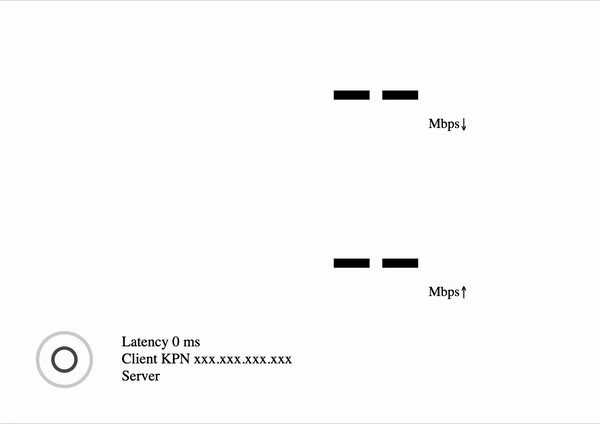

# Speedtest.net for PHP

Library and command line interface to run server-side speedtests via [Speedtest.net](https://www.speedtest.net/) from cli or web interface.


This library is an updated version of [aln-1/speedtest-php](https://github.com/aln-1/speedtest-php) ported from the Python version [sivel/speedtest-cli](https://github.com/sivel/speedtest-cli).

[](//packagist.org/packages/nextpost-tech/speedtest-php)
[](//packagist.org/packages/nextpost-tech/speedtest-php)
[](//packagist.org/packages/nextpost-tech/speedtest-php)
[](//packagist.org/packages/nextpost-tech/speedtest-php)

# Navigation

- [Installation](#installation)
    - [How to install library **to existing project** using Composer](#how-to-install-library-to-existing-project-using-composer)
        - [As project dependency](#as-project-dependency)
        - [By updating composer.json file of your project](#by-updating-composerjson-file-of-your-project)
    - [How to install library **to new project** using Composer](#how-to-install-library-to-new-project-using-composer)
- [Update](#update)
- [Examples](#examples)
    - [Regular Usage](#regular-usage)
        - [Minimal code](#)
        - [With progress callback](#)
    - [CLI Usage](#cli-usage)
- [Support](#support)
- [Paid Consultations & Personal Help](#paid-consultations--personal-help)

# Installation

## How to install library **to existing project** using Composer

Since, our repository are public package we listed this repository on Packagist, that's mean we don't need to instruct Composer about which GitHub repository to look for inorder to find the package.

### As project dependency

- Install library using the following commands:

```console
cd /path-to-app/
composer require nextpost-tech/speedtest-php
```

### By updating composer.json file of your project

- Open file named as `composer.json` in project folder `/path-to-app/`

- Add following content to this file:

```php
{
    "require": {
        // ---
        // Other packages
        // ---
        "nextpost-tech/speedtest-php": "^1.0"
    }
}
```

- After that install library using the following commands:

```console
cd /path-to-app/
composer update
```

- `/path-to-app/` project folder with existing `composer.json` file 

## How to install library **to new project** using Composer

Use following command, when you need to install library **to new project** using Composer:

- If Composer not installed on your server/local machine, please follow this [installation guide](https://www.digitalocean.com/community/tutorials/how-to-install-and-use-composer-on-ubuntu-20-04)

- Create blank file named as `composer.json` in project folder

- Add following content to this file:

```php
{
    "require": {
        "nextpost-tech/speedtest-php": "^1.0"
    }
}
```

- After that install library using the following command:

```console
cd /path-to-app/
composer update
```

- `/path-to-app/` project folder with existing `composer.json` file

# Update

Use following command, when you need to update library to latest version:

```php
cd /path-to-app/
composer update
```

- `/path-to-app/` project folder with existing `composer.json` file

# Examples

## Regular Usage

### Minimal code

Code:

```php
require 'vendor/autoload.php';

$speedtest = new NextpostTech\Speedtest\Speedtest();
$speedtest->getServers();
$speedtest->getBestServer();
$speedtest->download();
$speedtest->upload();

$results = $speedtest->results();

print_r($results);
```

Output:

```console
NextpostTech\Speedtest\Result Object
(
    [latency:protected] => 4.57
    [download:protected] => 47888585.578516
    [upload:protected] => 64841042.860629
    [bytesReceived:protected] => 59881235
    [bytesSent:protected] => 82579808
)
```

Units:
- latency = ms
- download / upload = bits/s
- bytesReceived / bytesSent = bytes

### With progress callback

Code:

```php
require 'vendor/autoload.php';

$config = new NextpostTech\Speedtest\Config();
$config->setCallback(function ($results) { print_r($results); });

$speedtest = new NextpostTech\Speedtest\Speedtest($config);
$speedtest->getServers();
$speedtest->getBestServer();
$speedtest->download();
```

Output:

```console
NextpostTech\Speedtest\Result Object
(
    [latency:protected] => 4.40
    [download:protected] => 0
    [upload:protected] =>
    [bytesReceived:protected] => 0
    [bytesSent:protected] => 0
)

// More dump was here ...

```console
NextpostTech\Speedtest\Result Object
(
    [latency:protected] => 4.40
    [download:protected] => 27519752.835724
    [upload:protected] =>
    [bytesReceived:protected] => 37153149
    [bytesSent:protected] => 0
)
```

Units:
- latency = ms
- download / upload = bits/s
- bytesReceived / bytesSent = bytes

We are showing here only first and last callback results from the download method.

## Web demo

A one page demo is available at `resources/demo.php`



## CLI Usage

Console:

```console
/path-to-app/vendor/bin/speedtest -h
```

Output:

```console
usage: speedtest [-h] [--no-download] [--no-upload] [--single] [--bytes]
                 [--share] [--simple] [--json] [--list] [--server=SERVER]
                 [--exclude=EXCLUDE] [--source=SOURCE] [--timeout=TIMEOUT]
                 [--proxy=PROXY] [--version]

Command line interface to run server-side speedtests via Speedtest.net from cli or web interface.
--------------------------------------------------------------------------
https://github.com/nextpost-tech/speedtest-php

optional arguments:
  -h, --help            Show this help message and exit
  --no-download         Do not perform download test
  --no-upload           Do not perform upload test
  --single              Only use a single connection instead of multiple. This
                        simulates a typical file transfer
  --bytes               Display values in bytes instead of bits. Does not
                        affect the image generated by --share, nor output from
                        --json
  --share               Generate and provide a URL to the speedtest.net share
                        results image
  --simple              Suppress verbose output and progress, only shows results
  --json                Output in JSON format. Speeds listed in bits and not
                        affected by --bytes. Can be combined with --simple
                        to supress progress
  --list                Display a list of speedtest.net servers sorted by
                        distance
  --server=SERVER       Specify a server ID to test against. Can be comma
                        separated values
  --exclude=EXCLUDE     Exclude a server from selection. Can be comma
                        separated values
  --source=SOURCE       Source IP address to bind to or interface name
  --timeout=TIMEOUT     HTTP timeout in seconds, default 10
  --proxy=PROXY         Use a proxied connection for test
  --version             Show the version number
```

- `/path-to-app/` project folder 

# Support

This is a developer's portal for Speedtest.net for PHP and should not be used for support. Please [contact us via website chat](https://nextpost.tech/#chatraChatExpanded) if you need to submit a support request.

# Paid Consultations & Personal Help

Please [contact us via website chat](https://nextpost.tech/#chatraChatExpanded) if you need additional help with your own project, we will try to find best options for you.


